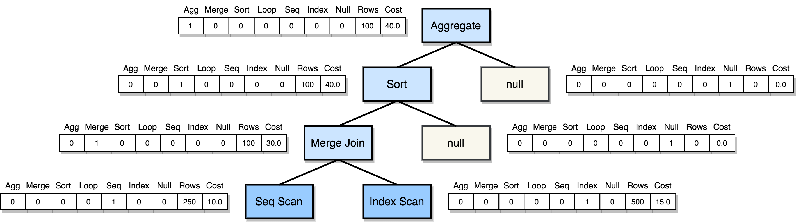
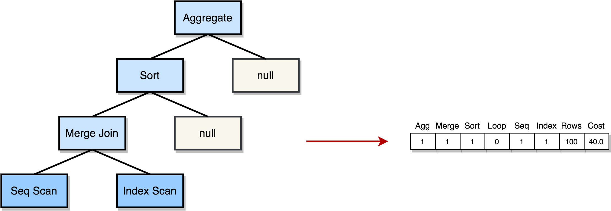

# SQL to Vector
This Python tool provides an implementation of a simple parser and vectorizer for SQL query plans produced by an underlying PostgreSQL query optimizer. It offers two different types of vector representations at two different granularities. It is aimed towards the use of machine learning techniques in query optimization and can be further extended by the introduction of new features in a straightforward way.

## Installation Prerequisites

* [psycopg2](https://pypi.org/project/psycopg2/)
* [nested_lookup](https://pypi.org/project/nested-lookup/)

At a command prompt, run the following command to install both packages:

`pip install -r requirements.txt`

## Usage

The program receives a query in *.sql* format as input. As mentioned above, you can choose between two different forms of vector representation.

### 1. Tree

The first one preserves the inherent tree structure and can be then fed into a [*Tree Convolutional Neural Network (TCNN)*](https://github.com/RyanMarcus/TreeConvolution).

At a command prompt, run the following command:

`python main.py --query query_file.sql --type tree`

### 2. Vector

The second one provides a simplified version and encodes the query plan as a single vector. It is aimed towards the usage of more traditional machine learning approaches. It generates a set of features containing query optimizer estimates, such as operator cardinalities and plan execution costs together with the occurrence count of each operator type in the query plan.

At a command prompt, run the following command:

`python main.py --query query_file.sql --type vector`

Use *--help* to get the description of each argument:

`python main.py --help`
